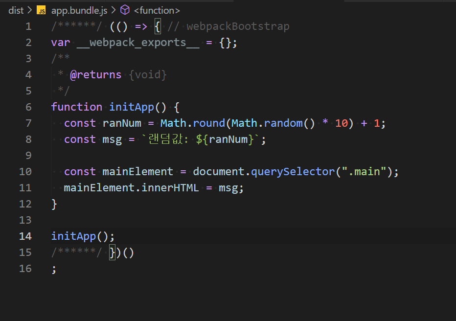
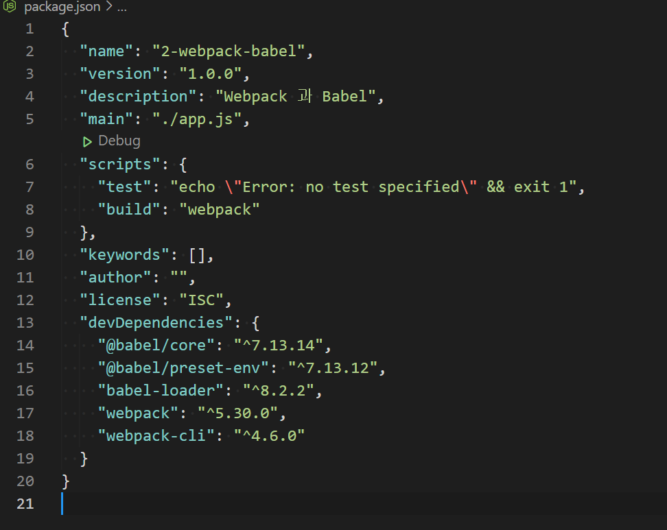
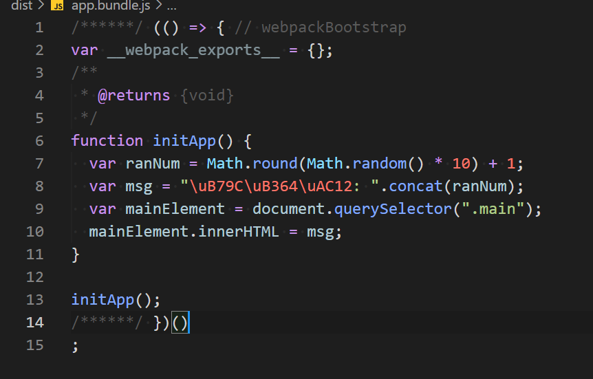

##### top
# Webpack 과 Babel

[돌아가기](https://github.com/Chocobe/-Study-Webpack)

## 1. Webpack 설정이 완료된 프로젝트 만들기 ([1. Webpack 기본설정](https://github.com/Chocobe/-Study-Webpack/tree/master/1.%20webpack%20%EA%B8%B0%EB%B3%B8%EC%84%A4%EC%A0%95))

이전 단계의 ``webpack`` 만 사용하는 프로젝트를 만듭니다.

<br/>

``webpack`` 만 사용했을 때 build 결과는 다음과 같습니다.

<br/>


<br/>

[🔺 Top](#top)

<br/><hr/><br/>


## 2. ``@babel/core`` , ``@babel/preset-env`` , ``babel-loader`` 설치

``babel`` 은 구버전 Browser 에서도 인식할 수 있는 ``Javascript`` 버전으로 변환해 주는 도구 입니다.

``babel`` 의 사용 전후를 비교해 보면, Javascript 최신문법이 구버전으로 변환된 것을 확인할 수 있습니다.

```bash
  // 터미널
  npm i -D @babel/core @babe/preset-env babel-loader
```

<br/>

설치가 완료되면, ``package.json`` 의 ``devDependencies`` 에 추가된 것을 확인할 수 있습니다.

<br/>


<br/>

[🔺 Top](#top)

<br/><hr/><br/>


3. ``webpack.config.js`` 에 ``babel`` 설정

``babel`` 은 ``webpack`` 의 ``build`` 모듈로써 등록해야 합니다.

``webpack`` 의 Module 등록은 ``module`` 속성으로 등록 합니다.

<details>
<summary>webpack.config.js 코드보기</summary>

```javascript
var path = require("path");

module.exports = {
  mode: "none",
  entry: "./app.js",
  output: {
    filename: "app.bundle.js",
    path: path.resolve(__dirname, "dist")
  },
  module: {
    rules: [
      {
        // babel 처리 대상
        test: /\.(m?js)$/,
        // loader 설정
        use: {
          loader: "babel-loader",
          options: {
            presets: ["@babel/preset-env"]
          }
        },
        // 제외 경로
        exclude: /(node_modules|bower_components)/
      }
    ]
  }
}
```
</details>


<br/>

[🔺 Top](#top)

<br/><hr/><br/>


4. ``build`` 실행

``babel`` 설정을 추가한 상태로 ``build`` 명령을 실행 합니다.

```bash
  // 터미널
  npm run build
```

<br/>

Build 가 완료되면, 다음과 같은 결과물이 생성 됩니다.

<br/>


<br/>

[🔺 Top](#top)

<br/><hr/><br/>


5. ``babel`` 사용 전후 비교

``babel`` 을 사용하여 ``build`` 할 경우, Javascript 최신 문법이 구버전 문법으로 변경된 것을 확인할 수 있습니다.

|babel 사용 전|babel 사용 후|
|---|---|
|<br/>|<br/>|


<br/>

[🔺 Top](#top)

<br/><hr/><br/>