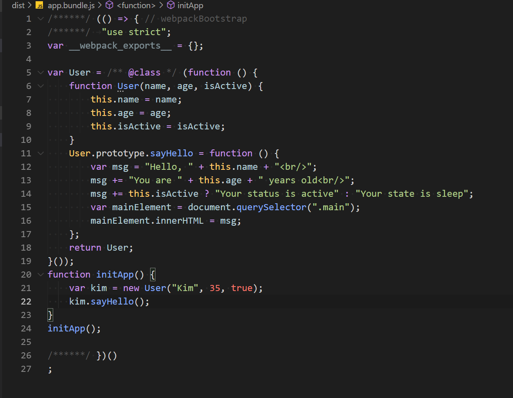

##### top
# Webpack 과 TS

[돌아가기](https://github.com/Chocobe/-Study-Webpack)

## 1. Webpack 설정이 완료된 프로젝트 만들기 ([1. Webpack 기본설정](https://github.com/Chocobe/-Study-Webpack/tree/master/1.%20webpack%20%EA%B8%B0%EB%B3%B8%EC%84%A4%EC%A0%95))

이전 단계의 ``webpack`` 만 사용한 프로젝트를 동일하게 만듭니다.


<br/>

[🔺 Top](#top)

<br/><hr/><br/>


## 2. ``index.html`` 생성 및 작성

이전 과정의 ``index.html`` 과 동일합니다.

<details>
<summary>index.html</summary>

```html
<!DOCTYPE html>
<html lang="en">
  <head>
    <meta charset="UTF-8">
    <meta http-equiv="X-UA-Compatible" content="IE=edge">
    <meta name="viewport" content="width=device-width, initial-scale=1.0">
    <title>Document</title>
  </head>

  <body>
    <h1>Webpack 과 TS</h1>

    <div class="main">
      Now Loading...
    </div>

    <script lang="javascript" src="./dist/app.bundle.js"></script>
  </body>
</html>
```
</details>


<br/>

[🔺 Top](#top)

<br/><hr/><br/>


## 3. ``app.ts`` 파일 생성 및 작성

``typescript`` 의 문법을 사용하여 작성 합니다.

(ES2015 이상 문법을 사용하여, ``build`` 결과가 ``ES5`` 로 생성되는지 확인하도록 작성 합니다)

<details>
<summary>app.ts 코드보기</summary>

```typescript
class User {
  name: string;
  age: number;
  isActive: boolean;

  constructor(name: string, age: number, isActive: boolean) {
    this.name = name;
    this.age = age;
    this.isActive = isActive;
  }

  sayHello(): void {
    let msg = `Hello, ${this.name}<br/>`;
    msg += `You are ${this.age} years old<br/>`;
    msg += this.isActive ? `Your status is active` : `Your state is sleep`;

    const mainElement = document.querySelector(".main") as HTMLDivElement;
    mainElement.innerHTML = msg;
  }
}

function initApp(): void {
  const kim = new User("Kim", 35, true);
  kim.sayHello();
}

initApp();
```
</details>


<br/>

[🔺 Top](#top)

<br/><hr/><br/>


## 4. ``typescript`` , ``ts-loader`` 설치

``typescript`` 를 사용하기 위해, 다음 패키지를 설치 합니다.

```bash
  // 터미널
  npm i -D typescript ts-loader
```

<br/>

``ts-loader`` 는 ``webpack`` 이 ``.ts`` 파일을 읽을 수 있도록 합니다.

(``ts-loader`` 를 사용할 시, ``@babel/preset-typescript`` 를 함께 사용하면 에러가 발생합니다)


<br/>

[🔺 Top](#top)

<br/><hr/><br/>


## 5. ``tsconfig.json`` 생성 및 설정

Typescript 설정 파일인 ``tsconfig.json`` 파일을 생성하고, 다음과 같이 설정 합니다.

<details>
<summary>tsconfig.json 코드보기</summary>

```json
{
  "compilerOptions": {
    // 엄격모드
    "strict": true,
    // .js 파일 허용
    "allowJs": true,
    // .js 파일의 Type 검사 여부
    "checkJs": true,

    // 사용 모듈
    "module": "ESNext",
    // 빌드 결과에 적용시킬 모듈버전
    "target": "ES5",
    // 빌드 시, 사용할 모듈
    "lib": ["ESNext", "DOM", "DOM.Iterable"],
    // Module 처리방식: Node(상대경로)
    "moduleResolution": "Node",

    // 빌드 결과파일 생성 경로 (webpack 사용 시, webpack 의 output 이 적용됨)
    "outDir": "dist"
  },

  "exclude": ["node_modules", "dist"]
}
```
</details>


<br/>

[🔺 Top](#top)

<br/><hr/><br/>


## 6. ``webpack.config.js`` 생성 및 설정

기존에 작성했던 ``webpack.config.js`` 에 ``ts-loader`` 설정 및 기존 설정을 수정 합니다.

<details>
<summary>webpack.config.js 코드보기</summary>

```javascript
var path = require("path");

module.exports = {
  mode: "none",

  // 수정: "./app.js" => "./app.ts"
  entry: "./app.ts",
  
  output: {
    filename: "app.bundle.js",
    path: path.resolve(__dirname, "dist")
  },

  // loader 설정부
  module: {
    rules: [
      // ts-loader 설정
      {
        // 대상 파일명 RegExp
        test: /\.(ts|js)x?$/,
        // 제외 경로
        exclude: /(node_modules|dist)/,
        use: "ts-loader"
      }
    ]
  }
}
```
</details>


<br/>

[🔺 Top](#top)

<br/><hr/><br/>


## 7. ``build`` 실행 및 확인

``npm run build`` 명령으로 ``build`` 를 실행 시키면, ``tsconfig.json`` 에 설정한 ``ES5`` 버전의 ``build 결과물`` 이 생성 됩니다.

<br/>


<br/>

[🔺 Top](#top)

<br/><hr/><br/>


## 8. ``alias`` 설정

``import`` 문을 사용할 때, 특정 경로에 대한 명칭을 지정할 수 있습니다.

``Javascript`` 만 사용할 경우에는 ``webpack.config.js`` 의 ``resolve.alias`` 에서 설정할 수 있습니다.

```javascript
// webpack.config.js

var path = require("path");

module.exports = {
  mode: "none",
  entry: "./app.ts",
  output: {
    filename: "app.bundle.js",
    path: path.resolve(__dirname, "dist")
  },

  module: {
    rules: [
      {
        test: /\.(t|j)sx?$/,
        use: "ts-loader",
        exclude: /(node_modules|dist)/
      }
    ]
  },

  resolve: {
    alias: {
      "@": path.resolve(__dirname, "src")
    }
  }
}
```

<br />

위 처럼 ``webpack.config.js`` 를 설정한 후, ``src/RandomNum.js`` 파일을 ``import`` 한다면, 다음과 같이 사용할 수 있습니다.

```javascript
// app.js

// 가져온 경로: "./src/RandomNum"
import RandomNum from "@/RandomNum";
```

<br />

여기서 ``Typescript`` 파일을 ``import`` 하려면, ``tsconfig.json`` 에 ``paths`` 설정을 추가해 주어야 합니다.

``webpack`` 의 경우는 ``Build`` 할 때 영향을 받는 설정이지만, ``typescript`` 는 컴파일 전 시점에서 별도로 동작하기 때문입니다.

```json
{
  "compilerOptions": {
    // 엄격모드
    "strict": true,
    // .js 파일 허용
    "allowJs": true,
    // .js 파일의 Type 검사 여부
    "checkJs": true,

    // 사용 모듈
    "module": "ESNext",
    // 빌드 결과에 적용시킬 모듈버전
    "target": "ES5",
    // 빌드 시, 사용할 모듈
    "lib": ["ESNext", "DOM", "DOM.Iterable"],
    // Module 처리방식: Node(상대경로)
    "moduleResolution": "Node",

    // 빌드 결과파일 생성 경로 (webpack 사용 시, webpack 의 output 이 적용됨)
    "outDir": "dist",

    // Root 경로 설정
    "baseUrl": "./",
    // alias 설정 - webpack.config.js 에서 설정한 alias 와 동일한 경로로 설정하기
    // => 주의할 점은, ``key`` 와 ``value`` 모두 ``/*`` 를 뒤에 붙여 주어야 합니다.
    "paths": {
      "@/*": ["./src/*"]
    }
  },

  "exclude": ["node_modules", "dist"]
}
```

<br />

설정이 완료되면, ``typescript`` 파일을 ``import`` 할 때에도 ``alias`` 를 사용할 수 있습니다.

```typescript
// app.ts

// 가져온 경로: "./src/RandomNum"
import RandomNum from "@/RandomNum";
```
