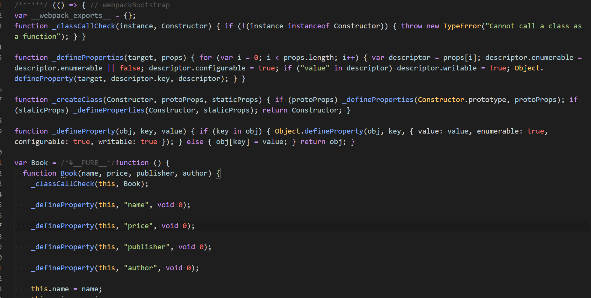
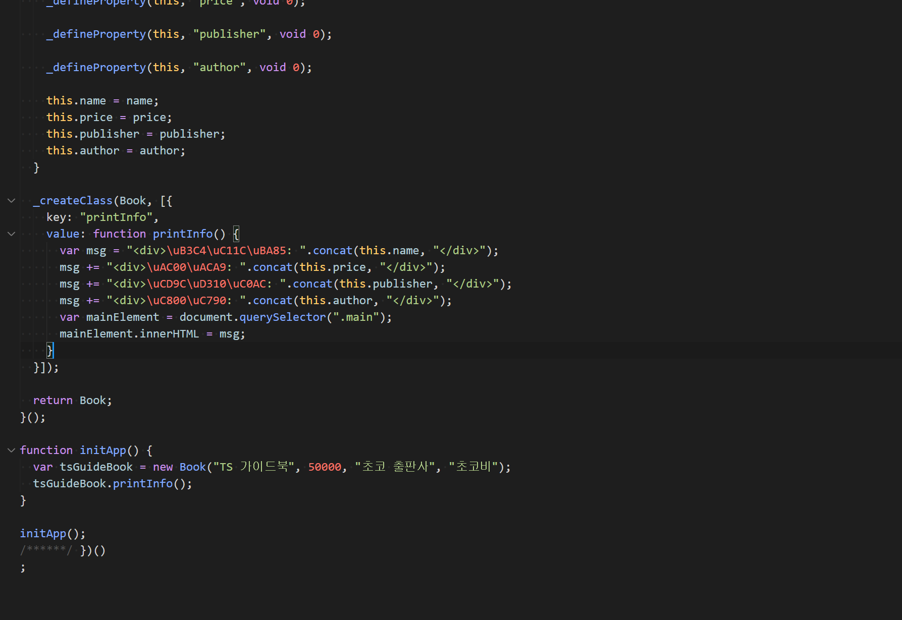

##### top
# Webpack 과 TS

[돌아가기](https://github.com/Chocobe/-Study-Webpack)

## 1. Webpack 설정이 완료된 프로젝트 만들기 ([1. Webpack 기본설정](https://github.com/Chocobe/-Study-Webpack/tree/master/1.%20webpack%20%EA%B8%B0%EB%B3%B8%EC%84%A4%EC%A0%95))

이전 단계의 ``webpack`` 만 사용한 프로젝트를 동일하게 만듭니다.


<br/>

[🔺 Top](#top)

<br/><hr/><br/>


## 2. ``index.html`` 생성 및 작성

이전 과정의 ``index.html`` 과 동일합니다.

<details>
<summary>index.html 코드보기</summary>

```html
<!DOCTYPE html>
<html lang="en">
  <head>
    <meta charset="UTF-8">
    <meta http-equiv="X-UA-Compatible" content="IE=edge">
    <meta name="viewport" content="width=device-width, initial-scale=1.0">
    <title>Document</title>
  </head>

  <body>
    <h1>Webpack 과 TS</h1>

    <div class="main">
      Now Loading...
    </div>

    <script lang="javascript" src="./dist/app.bundle.js"></script>
  </body>
</html>
```
</details>


<br/>

[🔺 Top](#top)

<br/><hr/><br/>


3. ``tsconfig.json`` 생성 및 작성

Typescript 설정을 합니다.

추가된 부분으로 ``noEmit: true`` 는 변환 결과 파일을 생성하지 않도록 합니다.

Webpack 에 연동시킨 ``Babel`` 에 의해 컴파일 결과물을 생성할 것이므로, ``noEmit: true`` 설정을 합니다.

<details>
<summary>tsconfig.json 코드보기</summary>

```json
{
  "compilerOptions": {
    "strict": true,
    "allowJs": true,
    "checkJs": true,

    "module": "ESNext",
    "target": "ES5",
    "lib": ["ESNext", "DOM", "DOM.Iterable"],
    "moduleResolution": "Node",

    "noEmit": true,
  },

  "exclude": ["./node_modules", "./dist"]
}
```
</details>


<br/>

[🔺 Top](#top)

<br/><hr/><br/>


## 4. ``app.ts`` 파일 생성 및 작성

``typescript`` 의 문법을 사용하여 작성 합니다.

(ES2015 이상 문법을 사용하여, ``build`` 결과가 ``ES5`` 로 생성되는지 확인하도록 작성 합니다)

<details>
<summary>app.ts 코드보기</summary>

```typescript
class Book {
  private name: string;
  private price: number;
  private publisher: string;
  private author: string;

  constructor(name: string, price: number, publisher: string, author: string) {
    this.name = name;
    this.price = price;
    this.publisher = publisher;
    this.author = author;
  }

  printInfo(): void {
    let msg = `<div>도서명: ${this.name}</div>`;
    msg += `<div>가격: ${this.price}</div>`;
    msg += `<div>출판사: ${this.publisher}</div>`;
    msg += `<div>저자: ${this.author}</div>`;

    const mainElement = document.querySelector(".main") as HTMLDivElement;
    mainElement.innerHTML = msg;
  }
}

function initApp(): void {
  const tsGuideBook = new Book("TS 가이드북", 50000, "초코 출판사", "초코비");
  tsGuideBook.printInfo();
}
```
</details>


<br/>

[🔺 Top](#top)

<br/><hr/><br/>


## 5. 라이브러리 설치

Webpack 에 연동시킬 ``Babel`` 과 ``Typescript`` 를 설치 합니다.

* ``Babel`` 라이브러리 목록
    * ``@babel/core``
    * ``babel-loader``
    * ``@babel/preset-env``
    * ``@babvel/preset-typescript``
    * ``@babel/plugin-proposal-class-properties``
    * ``@babel/plugin-proposal-object-rest-spread``

```bash
npm i -D @babel/core babel-loader @babel/preset-env @babel/preset-typescript @babel/plugin-proposal-class-properties @babel/plugin-proposal-object-rest-spread
```


<br/>

[🔺 Top](#top)

<br/><hr/><br/>


## 6. ``webpack.config.js`` 에 ``Babel`` 설정

Webpack 에 ``Babel`` 을 연동하게 되면, ``@babel/preset-typescript`` 에 의해 ``Typescript`` 파일을 컴파일 하도록 합니다.

(``ts-loader`` 를 사용하지 않고, ``babel`` 의 ``presets`` 를 사용하게 됩니다.)

<details>
<summary>webpack.config.js 코드보기</summary>

```javascript
var path = require("path");

module.exports = {
  mode: "none",
  entry: "./app.ts",
  output: {
    filename: "app.bundle.js",
    path: path.resolve(__dirname, "dist")
  },
  module: {
    rules: [
      {
        test: /\.(ts|js)x?$/,
        exclude: /(node_modules|dist)/,
        use: {
          loader: "babel-loader",
          options: {
            presets: [
              "@babel/preset-env",
              "@babel/preset-typescript"
            ],
            plugins: [
              "@babel/plugin-proposal-class-properties",
              "@babel/plugin-proposal-object-rest-spread"
            ]
          }
        }
      }
    ]
  }
}
```
</details>


<br/>

[🔺 Top](#top)

<br/><hr/><br/>


## 7. ``build`` 실행 및 확인

```bash
npm run build
```

Build 가 정상적으로 완료 되었다면, ``./dist/app.bundle.js`` 파일을 확인할 수 있습니다.

<br/>

<br/>


<br/>

[🔺 Top](#top)

<br/><hr/><br/>


## 8. ``babel`` & ``typescript`` 연동시, 알아야 할 점

``babel-loader`` 를 사용하여 ``Typescript`` 를 Build 할 경우, ``ts-loader`` 를 사용할 수 없습니다.

대신 ``@babel/preset-typescript`` 를 ``presets`` 으로 연결 시켜줘야 합니다.

<br/>

``babel`` 을 사용하여 ``Typescript`` 를 Build 할 경우, ``Type 검사`` 는 할 수 없습니다.

``babel`` 은 ``Typescript`` 의 ``Type 을 제거`` 하여, ``ES5`` 로 변환하기 때문입니다.

<br/>

만약 ``babel`` 과 ``Typescript`` 를 함꼐 사용한다면, 다음과 같이 기능을 분할하여 사용해야 합니다.
  1. ``Type 검사`` : ``tsc`` 사용
  2. ``Build`` : ``npm run build`` 사용


<br/>

[🔺 Top](#top)

<br/><hr/><br/>
