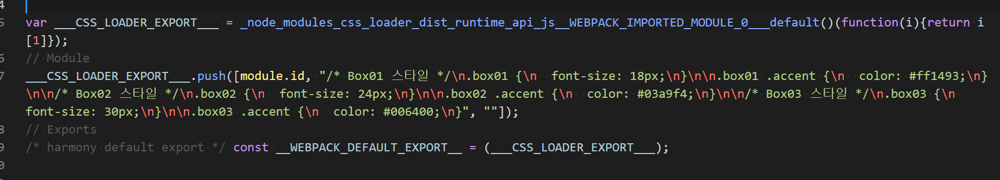

##### top
# Webpack 과 SASS

[돌아가기](https://github.com/Chocobe/-Study-Webpack)

## 1. Webpack 설정이 완료된 프로젝트 만들기 ([1. Webpack 기본설정](https://github.com/Chocobe/-Study-Webpack/tree/master/1.%20webpack%20%EA%B8%B0%EB%B3%B8%EC%84%A4%EC%A0%95))

이전 단계의 ``webpack`` 만 사용한 프로젝트를 동일하게 만듭니다.


<br/>

[🔺 Top](#top)

<br/><hr/><br/>


## 2. 라이브러리 설치

``CSS`` 를 ``Webpack`` 과 연동시키기 위한 라이브러리들을 설치 합니다.

```bash
  // 터미널
  npm i -D webpack webpack-cli css-loader style-loader
```


<br/>

[🔺 Top](#top)

<br/><hr/><br/>


## 3. ``webpack.config.js`` 에 ``css-loader`` , ``style-loader`` 설정

``webpack.config.js`` 파일을 생성한 후, ``css-loader`` , ``style-loader`` 를 설정 합니다.

<details>
<summary>webpack.config.js 코드보기</summary>

```javascript
var path = require("path");

module.exports = {
  mode: "none",
  entry: "./app.js",
  output: {
    filename: "app.bundle.js",
    path: path.resolve(__dirname, "dist")
  },
  module: {
    rules: [
      {
        test: /\.css$/,
        exclude: /(node_modules|dist)/,
        use: ["style-loader", "css-loader"]
      }
    ]
  }
}
```
</details>


<br/>

[🔺 Top](#top)

<br/><hr/><br/>


## 4. ``index.html`` 생성 및 작성

<details>
<summary>index.html 코드보기</summary>

```html
<!DOCTYPE html>
<html lang="en">
  <head>
    <meta charset="UTF-8">
    <meta http-equiv="X-UA-Compatible" content="IE=edge">
    <meta name="viewport" content="width=device-width, initial-scale=1.0">
    <title>Webpack & SASS</title>
  </head>

  <body>
    <h1>Webpack & SASS</h1>

    <div class="box01">
      Box01
      
      <span class="accent">
        강조글
      </span>
    </div>

    <div class="box02">
      Box02
      
      <span class="accent">
        강조글
      </span>
    </div>

    <div class="box03">
      Box03

      <span class="accent">
        강조글
      </span>
    </div>

    <script lang="javascript" src="./dist/app.bundle/js"></script>
  </body>
</html>
```
</details>


<br/>

[🔺 Top](#top)

<br/><hr/><br/>


## 5. ``myStyle.css`` 생성 및 작성

<details>
<summary>myStyle.css 코드보기</summary>

```css
/* Box01 스타일 */
.box01 {
  font-size: 18px;
}

.box01 .accent {
  color: #ff1493;
}

/* Box02 스타일 */
.box02 {
  font-size: 24px;
}

.box02 .accent {
  color: #03a9f4;
}

/* Box03 스타일 */
.box03 {
  font-size: 30px;
}

.box03 .accent {
  color: #006400;
}
```
</details>


<br/>

[🔺 Top](#top)

<br/><hr/><br/>


## 6. ``app.js`` 생성 및 작성

``Webpack`` 에 설정한 ``css-loader`` , ``style-loader`` 는 ``Javascript`` 파일에 ``import`` 된 ``CSS`` 파일을 컴파일 하기위한 설정 입니다.

따라서 ``app.js`` 파일에 ``myStyle.css`` 를 ``import`` 시켜줍니다.

<details>
<summary>app.js 코드보기</summary>

```javascript
import "./myStyle.css";
```
</details>


<br/>

[🔺 Top](#top)

<br/><hr/><br/>


## 7. ``build`` 실행 및 확인

```bash
npm run build
```

Build 가 정상적으로 완료 되었다면, ``./dist/app.bundle.js`` 파일을 확인할 수 있습니다.

<br/>


<br/>

[🔺 Top](#top)

<br/><hr/><br/>


## 8. ``Webpack`` & ``SASS`` 연동시, 알아야 할 점

``Javascript`` 파일에 ``import`` 된 ``CSS`` 파일은 ``Loader`` 의 순서가 중요 합니다.

순서는 다음과 같습니다.

1. ``import`` 된 ``CSS`` 코드는 ``Javascript`` 내에 있으므로, ``CSS`` 코드를 읽을 수 있도록 해야 합니다.
  * 사용되는 Loader: ``css-loader``

2. ``Javascript`` 에서 읽은 ``CSS`` 코드를 ``Javascript`` 내에서 ``stylesheet`` 역할을 하도록 적용 시킵니다.
  * 사용되는 Loader: ``style-loader``

<br/>

위 순서는 ``Webpack`` 의 ``Loader`` 설정에서 정확한 순서로 설정 해야 합니다.

```javascript
// webpack.config.js
module.exports = {
  // ...생략
  module: {
    rules: [
      {
        test: /\.css$/,
        exclude: /(node_modules|dist)/,
        use: ["style-loader", "css-loader"]
      }
    ]
  }

  // ...생략
}
```

<br/>

``Loader`` 의 설정은 ``use배열`` 의 ``역순`` 으로 실행 됩니다.

따라서 위 예문과 같이 ``처음 실행될 Loader`` 를 ``마지막 요소`` 로 작성 합니다.

(``마지막에 실행될 Loader`` 는 ``첫번째 요소`` 로 작성 합니다)


<br/>

[🔺 Top](#top)

<br/><hr/><br/>
