##### top
# ESLint & Prettier

[돌아가기](https://github.com/Chocobe/-Study-Webpack)

## ``NPM`` 프로젝트로 초기화 합니다.

```bash
// 터미널
npm init -y
```


<br/>

[🔺 Top](#top)

<br/><hr/><br/>


## 2. ``app.js`` 생성 및 작성

``ESLint`` 와 ``Prettier`` 설정을 확인하기 위해, ``app.js`` 를 작성 합니다.

```javascript
var myData = {
  id: 1,
  name: 'Chocobe',
  isActive: true
}

function initApp() {
  console.log('Hello, ESLint & Prettier')
}

initApp()
```


<br/>

[🔺 Top](#top)

<br/><hr/><br/>


## 2. 라이브러리 설치

``ESLint`` 와 ``Prettier`` 관련 라이브러리를 설치 합니다.

```bash
  // 터미널
  npm i -D eslint prettier eslint-plugin-prettier eslint-config-prettier
```

* ``eslint`` : ``ESLint`` Core 라이브러리 입니다.
* ``prettier`` : ``Prettier`` Core 라이브러리 입니다.
* ``eslint-plugin-prettier`` : ``ESLint`` 에 ``Prettier`` 를 연동 시키기 위한 라이브러리 입니다.
* ``eslint-config-prettier`` : ``Prettier`` 와 충돌되는 ``ESLint`` 설정을 제거하기 위한 라이브러리 입니다.


<br/>

[🔺 Top](#top)

<br/><hr/><br/>


## 3. ``ESLint`` 초기화

``ESLint`` 를 설치하면, ``CLI`` 명령어를 사용할 수 있습니다.

``ESLint 초기화 명령`` 을 사용하기 ESLint 설정파일 ``(.eslintrc.js)`` 를 생성할 수 있습니다.

```bash
// 터미널
npx eslint --init
```

위 명령을 실행시키면, 몇 단계의 설정 선택을 하게 됩니다.

|설정|터미널 이미지|
|---|:---:|
|ESLint 사용방식 선택|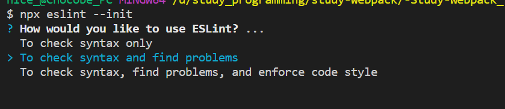|
|프로젝트의 JS Module 방식 선택|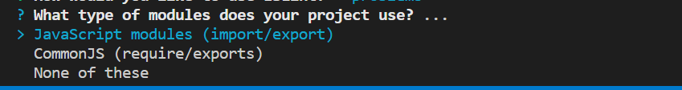|
|JS 프레임워크 선택|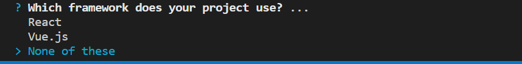|
|TS 사용여부 선택|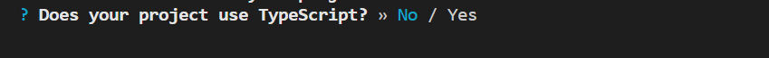|
|실행환경 선택|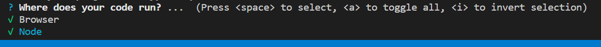|
|ESLint 설정파일 형식 선택|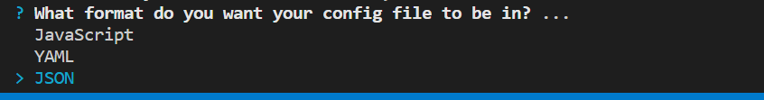|

<br/>

생성된 ``ESLint 설정파일 (.eslintrc.json)`` 을 확인할 수 있습니다.

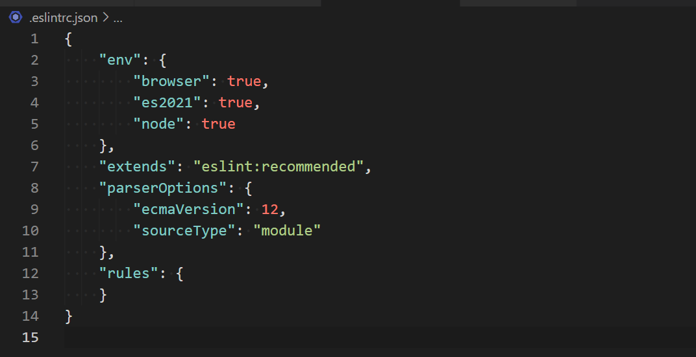<br/>


<br/>

[🔺 Top](#top)

<br/><hr/><br/>


## 4. ``.eslintrc.json`` 설정

생성된 ``.eslintrc.json`` 에 다음과 같이 설정 합니다.

<br/><br/>

<details>
<summary>.eslintrc.json 코드보기</summary>

```json
{
  "env": {
      "browser": true,
      "es2021": true,
      "node": true
  },
  "extends": [
    "eslint:recommended",
    "prettier"
  ],
  "plugins": [
    "prettier"
  ],
  "parserOptions": {
      "ecmaVersion": 2021,
      "sourceType": "module"
  },
  "rules": {
    "no-var": "error"
  }
}
```
</details>

<br/><br/>

``ESLint 설정`` 을 작성한 후 저장하면, ``app.js`` 에 에러가 발생 합니다.

갑자기 생긴 에러는 ``rules`` 에 설정한, ``no-var`` 설정에 의한 에러입니다.

``var`` 키워드를 사용할 경우 ``error`` 가 발생하도록 설정했기 때문입니다.


<br/>

[🔺 Top](#top)

<br/><hr/><br/>


## 5. ``VSCode 설정 (settings.json)`` 에 ``저장 시 자동수정 (autoFix)`` 설정

``app.js`` 에 발생한 에러는 직접 수정하는 방법도 있지만, ``VSCode 설정`` 을 사용하여, ``저장 시, 자동수정`` 기능을 사용할 수 있습니다.

<br/>

명령 팔레트 (``Ctrl`` + ``Shift`` + ``p``) 를 열고, ``workspace settings`` 를 검색 합니다.

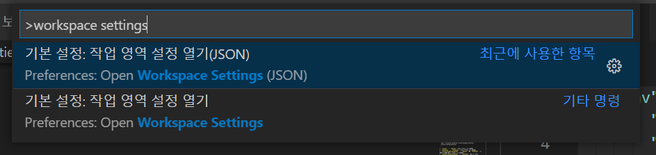<br/>

<br/>

설정파일 (``settings.json``) 에 자동저장 설정을 합니다.

<br/><br/>

<details>
<summary>settings.json 코드보기</summary>

```json
{
  // Formatting Plugin 에 의한 저장기능 끄기
  "editor.formatOnSave": false,

  // 저장시, ESLint 를 사용하여 모두 수정기능 켜기
  "editor.codeActionsOnSave": {
    "source.fixAll.eslint": true
  },

  // ESLint 검사대상 파일 설정
  "eslint.validate": [
    {
      "language": "javascript",
      "autoFix": true,
    },
    {
      "language": "typescript",
      "autoFix": true,
    }
  ]
}
```
</details>

<br/><br/>

``settings.json`` 을 설정한 후, ``app.js`` 에서 ``저장`` 하게되면, ``var`` 키워드가 ``let`` 으로 자동수정 되는것을 확인할 수 있습니다.

<br/>

``.eslintrc.json`` 의 ``rules`` 에 다음 항목을 추가하면, ``let`` 보다는 ``const`` 를 사용하도록 자동수정 기능을 변경할 수 있습니다.

```json
{
  // ...생략

  "rules": {
    "no-var": "error",
    "prefer-const": "error"
  }
}
```

<br/>

|ESLint ``rules`` 의 "error" 설정|저장시 자동수정 결과|
|---|:---:|
|없음|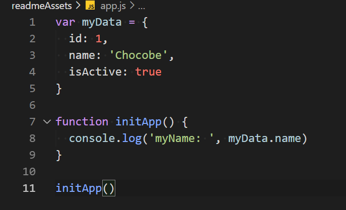|
|"no-var"|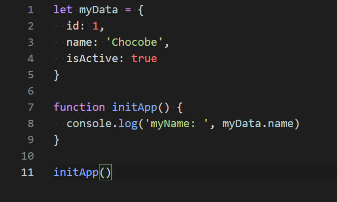|
|"no-var"<br/>"prefer-const"||


<br/>

[🔺 Top](#top)

<br/><hr/><br/>


## 6. ``prettier`` 설정 추가

``ESLint`` 설정은 상세한 코딩 스타일을 설정할 수 없습니다.

``Prettier`` 를 사용하면 사용자의 스타일에 맞게 다양한 코딩 스타일을 설정할 수 있기 때문에, ``ESLint`` 와 연동하여 사용 합니다.

``ESLint`` 와 ``Prettier`` 의 연동방식은, ``ESLint`` 의 ``plugin`` 으로 ``Prettier`` 를 사용하는 방식 입니다.

<br/>

``Prettier`` 를 설정 하기위해, ``.prettierrc.json`` 을 생성하여 작성할 수도 있지만, ``.eslintrc.json`` 의 설정에 한번에 작성 하겠습니다.

(코드 스타일을 설정하는 것은 ``ESLint`` 와 ``Prettier`` 모두 역할을 하므로, 한눈에 보기위해서 ``.eslintrc.json`` 에 함께 작성 합니다)

<br/><br/>

<details>
<summary>.eslintrc.json 코드보기</summary>

```json
{
  "env": {
    "browser": true,
    "es2021": true,
    "node": true,
  },
  "extends": [
    "eslint:recommended",
    // eslint-config-prettier 라이브러리 필요
    "prettier"
  ],
  "plugins": [
    // eslint-plugin-prettier 라이브러리 필요
    "prettier"
  ],
  "parserOptions": {
    "ecmaVersion": 2021,
    "sourceType": "module"
  },
  "rules": {
    "no-var": "error",
    "prefer-const": "error",

    "prettier/prettier": [
      "error",
      {
        "singleQuote": false,
        "semi": true,
        "useTabs": true,
        "tabWidth": 2,
        "trailingComma": "all",
        "printWidth": 150,
        "bracketSpacing": true,
        "arrowParens": "avoid"
      }
    ]
  }
}
```
</details>

<br/><br/>

``Prettier`` 설정을 추가하면, ``app.js`` 에 더 많은 에러가 발생하며, ``저장`` 하면, ``Prettier`` 의 설정까지 적용된 ``자동수정`` 기능이 동작합니다.

|저장 전 ``app.js``|저장 후 ``app.js``|
|:---:|:---:|
|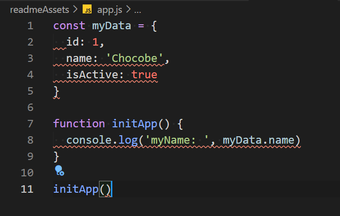|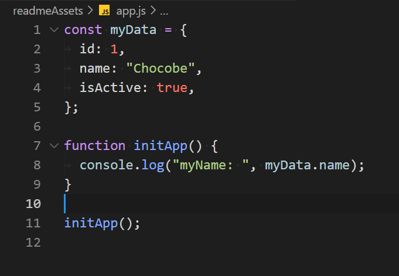|


<br/>

[🔺 Top](#top)

<br/><hr/><br/>


## 7. ``.eslintrc.json`` 설정시, 주의사항

``.eslintrc.json`` 뿐만 아니라, ``JSON`` 파일 설정파일에는 ``틀린문법`` 또는 ``TrailingComma`` 가 있을경우, 설정이 적용되지 않습니다.

즉, 설정파일을 작성 했음에도 동작하지 않는다면, 설정파일의 ``문법확인`` 으로 해결할 수 있습니다.

<br/>

``extends`` 설정의 ``prettier`` 는 가장 마지막 배열요소로 설정해야 합니다.

``eslint`` 관련 설정이 적용된 후, ``prettier`` 와 충돌되는 모든 설정을 제거해야 정상적으로 동작 합니다.

(``extends`` 의 ``prettier`` 설정은 ``eslint-config-prettier`` 라이브러리이며, ``prettier`` 와 충돌되는 ``eslint`` 설정을 제거해 줍니다)


<br/>

[🔺 Top](#top)

<br/><hr/><br/>
