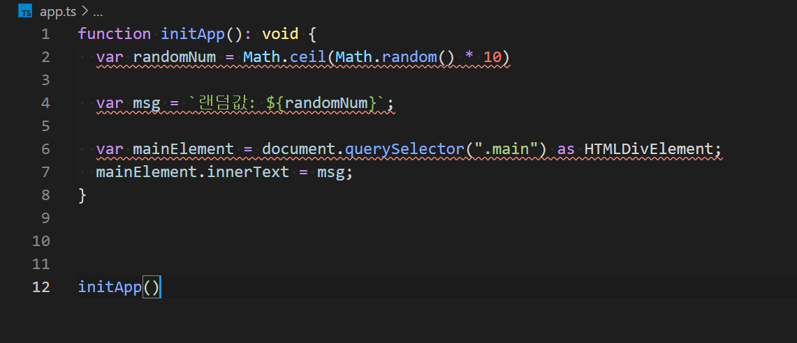
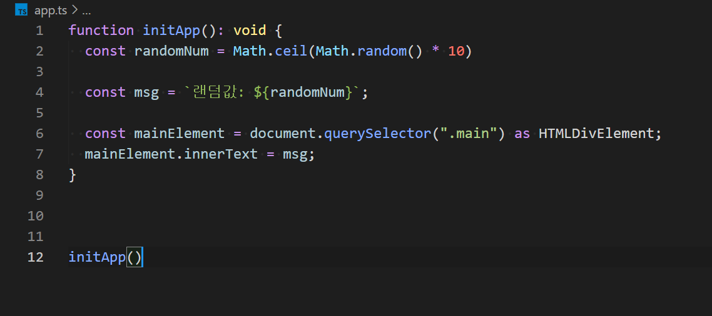
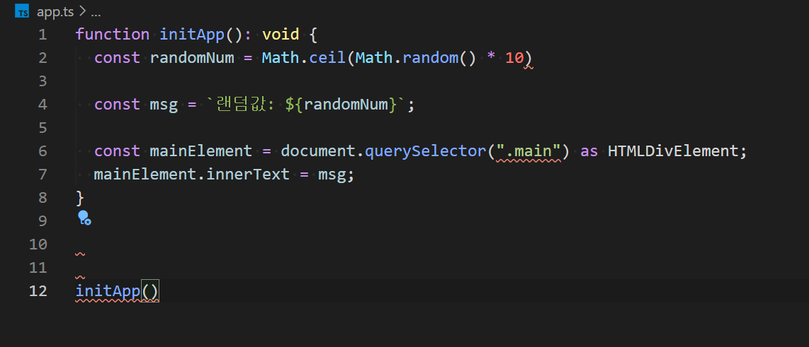
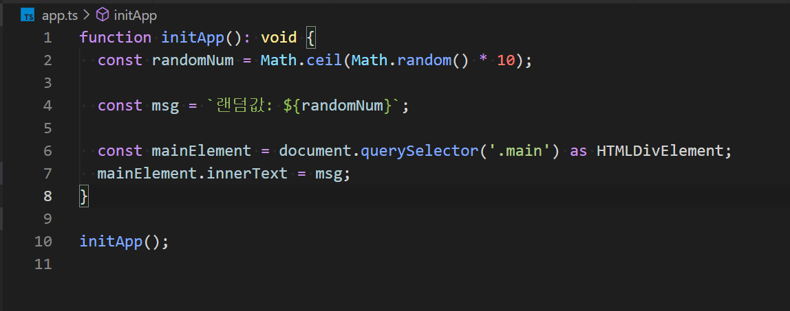

##### top
# Webpack & Typescript & ESLint & Prettier

[돌아가기](https://github.com/Chocobe/-Study-Webpack)

## 1. VSCode 의 작업영역에 ``저장시 자동수정`` 기능 설정

<br/><br/>

<details>
<summary>settings.json 코드보기</summary>

```json
{
  "editor.formatOnSave": false,
  "editor.codeActionsOnSave": {
    "source.fixAll.eslint": true
  },
  "eslint: validate": [
    {
      "language": "javascript",
      "autoFix": true
    },
    {
      "language": "typescript",
      "autoFix": true
    }
  ]
}
```
</details>

<br/><br/>


<br/>

[🔺 Top](#top)

<br/><hr/><br/>


## 2. ``index.html`` 생성 및 작성

``app.ts`` 가 적용된 결과를 확인할 수 있는 ``index.html`` 을 작성 합니다.

<br/><br/>

<details>
<summary>index.html 코드보기</summary>

```html
<!DOCTYPE html>
<html lang="en">
  <head>
    <meta charset="UTF-8">
    <meta http-equiv="X-UA-Compatible" content="IE=edge">
    <meta name="viewport" content="width=device-width, initial-scale=1.0">
    <title>Webpack & TS & ESLint & Prettier</title>
  </head>

  <body>
    <h1>Webpack & Typescript & ESLint & Prettier</h1>

    <div class="main">
      Now Loading...
    </div>
  </body>
</html>
```
</details>

<br/><br/>


<br/>

[🔺 Top](#top)

<br/><hr/><br/>


## 3. ``app.ts`` 생성 및 작성

``index.html`` 의 ``.main`` 요소에 값을 변경 시키는 초기화 메서드를 작성 합니다.

<br/><br/>

<details>
<summary>app.ts 코드보기</summary>

```typescript
function initApp(): void {
  var randomNum = Math.ceil(Math.random() * 10)

  var msg = `랜덤값: ${randomNum}`

  var mainElement = document.querySelector(".main") as HTMLDivElement;
  mainElement.innerText = msg;
}

initApp()
```
</details>

<br/><br/>


<br/>

[🔺 Top](#top)

<br/><hr/><br/>


## 4. ``webpack`` , ``webpack-cli`` , ``html-webpack-plugin`` , ``webpack-dev-server``, ``typescript`` , ``ts-loader`` 설치

라이브러리를 설치하기 전, ``NPM 프로젝트 초기화`` 를 실행 합니다.

```bash
npm init -y
```

<br/>

초기화 후, 다음 라이브러리를 설치 합니다.

```bash
npm i -D webpack webpack-cli webpack-dev-server html-webpack-plugin typescript ts-loader
```


<br/>

[🔺 Top](#top)

<br/><hr/><br/>


## 5. ``tsconfig.json`` 생성 및 작성

``tsconfig.json`` 에 ``Typescript`` 를 설정 합니다.

<br/><br/>

<details>
<summary>tsconfig.json 코드보기</summary>

```json
{
  "compilerOptions": {
    "strict": true,
    "allowJs": true,
    "checkJs": true,

    "target": "ES5",
    "module": "ESNext",
    "lib": ["ESNext", "DOM", "DOM.Iterable"],
    "moduleResolution": "Node",

    "outDir": "dist"
  },

  "exclude": [
    "./node_modules",
    "./dist"
  ]
}
```
</details>

<br/><br/>


<br/>

[🔺 Top](#top)

<br/><hr/><br/>


## 6. ``webpack.config.js`` 생성 및 설정

``Webpack`` 의 기본설정과 ``ts-loader`` 설정을 작성 합니다.

<br/><br/>

<details>
<summary>webpack.config.js 코드보기</summary>

```javascript
var path = require("path");
var HtmlWebpackPlugin = require("html-webpack-plugin");

module.exports = {
  mode: "none",
  entry: "./app.ts",
  output: {
    filename: "app.bundle.js",
    path: path.resolve(__dirname, "dist")
  },
  module: {
    rules: [
      {
        test: /\.tsx?$/,
        exclude: /(node_modules|dist)/,
        use: "ts-loader"
      }
    ]
  },
  plugins: [
    new HtmlWebpackPlugin({
      template: "./index.html"
    })
  ],
  devServer: {
    port: 9000
  }
}
```
</details>

<br/><br/>

추가로 ``package.json`` 의 ``script`` 에 다음 명령어를 추가 합니다.

<br/><br/>

<details>
<summary>package.json</summary>

```json
{
  // ...생략
  "scripts": {
    "build": "webpack",
    "serve": "webpack serve"
  },
  // ...생략
}
```
</details>

<br/><br/>

터미널을 사용하여 ``devServer`` 를 실행하면, ``Typescript`` 가 정상적으로 컴파일되어 적용된 것을 확인할 수 있습니다.

<br/>


<br/>

[🔺 Top](#top)

<br/><hr/><br/>


## 7. ``eslint`` , ``@typescript-eslint/parser`` , ``@typescript-eslint/eslint-plugin`` 설치

```bash
npm i -D eslint @typescript-eslint/parser @typescript-eslint/eslint-plugin
```


<br/>

[🔺 Top](#top)

<br/><hr/><br/>


## 8. ``ESLint 초기화`` 실행 및 설정

터미널을 사용하여 ``ESLint`` 를 초기화 합니다.

초기화 옵션 설정 중, ``typescript`` 사용을 설정하면 설정에 도움을 받을 수 있습니다.

```bash
npx eslint --init
```

<br/>

``ESLint`` 초기화로 생성된 ``.eslintrc.json`` 에 다음 설정을 합니다.

<br/><br/>

<details>
<summary>.eslintrc.json 코드보기</summary>

```json
{
  "env": {
    "browser": true,
    "es2021": true,
    "node": true
  },
  "extends": [
    "eslint:recommended",
    "plugin:@typescript-eslint/recommended"
  ],
  "parser": "@typescript-eslint/parser",
  "parserOptions": {
    "ecmaVersion": 12,
    "sourceType": "module"
  },
  "plugins": [
    "@typescript-eslint"
  ],
  "rules": {
    "no-var": "error",
    "prefer-const": "error"
  },
  "ignorePatterns": [
    "*.config.*",
    "node_modules",
    "dist"
  ]
}
```
</details>

<br/><br/>

위 설정까지 마친 후, ``app.ts`` 에 에러가 발생하지 않는다면, VSCode 를 재실행 해야 합니다.

재실행하면 ``app.ts`` 에 ``ESLint`` 에러가 발생한 것을 확인할 수 있습니다.

<br/>

<br/><br/>

``저장`` 을 실행하면, 다음과 같이 ``자동수정`` 이 됩니다.

<br/>

<br/><br/>


<br/>

[🔺 Top](#top)

<br/><hr/><br/>


## 9. ``prettier`` , ``eslint-config-prettier`` , ``eslint-plugin-prettier`` 설치

``ESLint`` 로는 할 수 없는 코드 스타일을 ``Prettier`` 를 연동하여 설정할 수 있습니다.

```bash
npm i -D prettier eslint-config-prettier eslint-plugin-prettier
```


<br/>

[🔺 Top](#top)

<br/><hr/><br/>


## 10. ``.eslintrc.json`` 에 ``Prettier`` 설정 추가

기존의 ``.eslintrc.json`` 에 ``Prettier`` 에 대한 설정을 추가 합니다.

<br/><br/>

<details>
<summary>.eslintrc.json</summary>

```json
{
  "env": {
    "browser": true,
    "es2021": true,
    "node": true
  },
  "extends": [
    "eslint:recommended",
    "plugin:@typescript-eslint/recommended",
    "prettier"
  ],
  "parser": "@typescript-eslint/parser",
  "parserOptions": {
    "ecmaVersion": 12,
    "sourceType": "module"
  },
  "plugins": [
    "@typescript-eslint",
    "prettier"
  ],
  "rules": {
    "no-var": "error",
    "prefer-const": "error",
    
    "prettier/prettier": [
      "error",
      {
        "singleQuote": false,
        "semi": true,
        "useTabs": true,
        "tabWidth": 2,
        "trailingComma": "all",
        "printWidth": 150,
        "bracketSpacing": true,
        "arrowParens": "avoid"
      }
    ]
  },
  "ignorePatterns": [
    "*.config.*",
    "node_modules",
    "dist"
  ]
}
```
</details>

<br/><br/>

위 설정까지 마친 후, ``app.ts`` 에 에러가 발생하지 않는다면, VSCode 를 재실행 해야 합니다.

재실행하면 ``app.ts`` 에 ``prettier/prettier`` 에러가 발생한 것을 확인할 수 있습니다.

<br/>

<br/><br/>

``저장`` 을 실행하면, 다음과 같이 ``자동수정`` 이 됩니다.

<br/>


<br/>

[🔺 Top](#top)

<br/><hr/><br/>


## 11. ``Webpack`` & ``Typescript`` & ``ESLint`` & ``Prettier`` 연동시, 알아야 할 점

설정파일을 생성한 직후, VSCode 에서 적용되지 않는 경우, VSCode 를 재실행 하면 해당 설정이 적용됩니다.

만약, 재실행 후에도 설정파일이 적용되지 않는다면, 설정에 ``오탈자`` 또는 ``tailingComma`` 등, 문법확인을 해야 합니다.

<br/>

``ESLint`` 설치 후 초기화 선택지 중 ``typescript`` 사용여부를 선택하면, ``ESLint`` 의 기본 ``Typescript`` 설정이 함께 생성 됩니다.


<br/>

[🔺 Top](#top)

<br/><hr/><br/>
